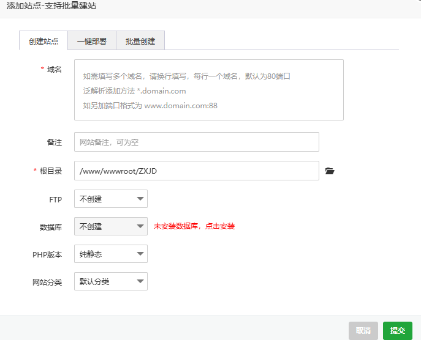
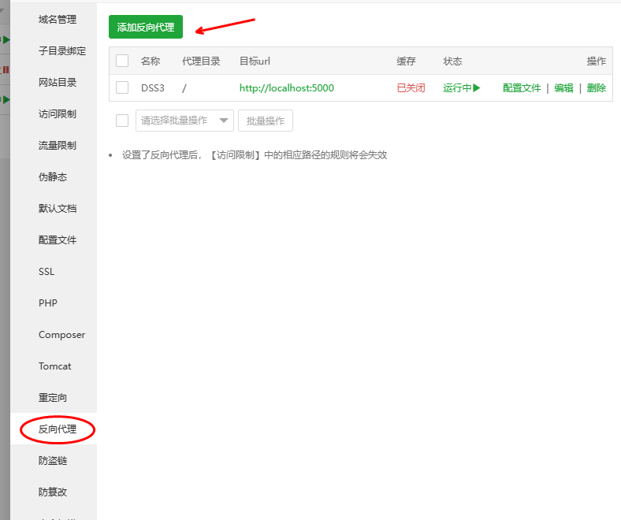
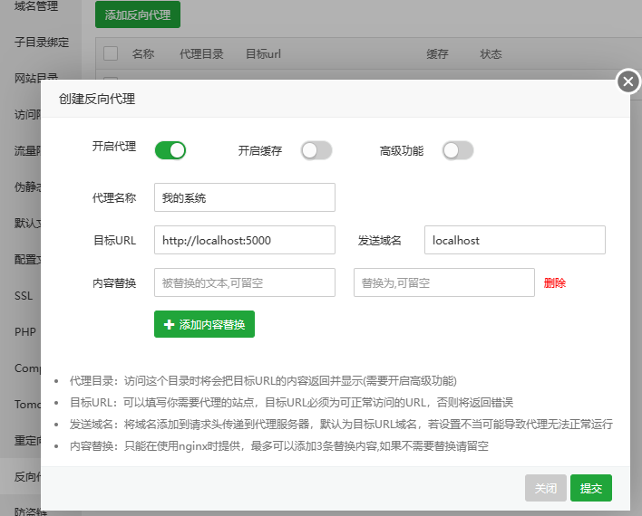
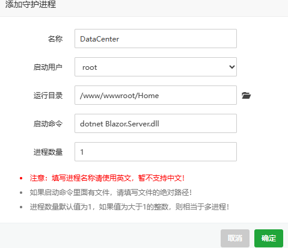

## AutoDomain 数据中台Linux部署

一. 安装宝塔面板

1. 请参考官方文档：[https://www.bt.cn/download/linux.html](https://www.bt.cn/download/linux.html)

二. 安装.net SDK

1. 在Debian上安装 [https://learn.microsoft.com/zh-cn/dotnet/core/install/linux-debian](https://learn.microsoft.com/zh-cn/dotnet/core/install/linux-debian)
2. 更多参考 [https://dotnet.microsoft.com/zh-cn/download/dotnet/7.0](https://dotnet.microsoft.com/zh-cn/download/dotnet/7.0)

三. 发布程序

1. 从宝塔面板添加网站
   
2. 将代码文件复制到添加的网站目录下面

四. 设置反向代理

1. 在宝塔面板点击刚添加网站后面的设置，然后找到反向代理，添加反向代理



2. 添加反向代理，
   代理名称随便填
   目标URL填写：[http://localhost:5000](http://localhost:5000/)
   发送域名填写:localhost
   

五. 使用守护进程

1. 通过宝塔面板安装守护进程
   这里我们使用 Supervisor 守护进程
   在宝塔面板-软件商店-搜索Supervisor 并安装
2. 配置守护进程
   点添加守护进程
   名称：请使用英文名称
   启动用户：root
   运行目录：选择前面添加网站并上传的程序代码目录
   启动命令填写：dotnet Blazor.Server.dll
   

六. 技巧
需要部署多个应用，启动命令可以添加参数：dotnet Blazor.Server.dll --urls [http://localhost:9001](http://localhost:9001/)

七. 常见问题
7.1 解决WebSocket 不能访问
修改反向代理-配置文件
```
#PROXY-START/
location  ~* \.(gif|png|jpg|css|js|woff|woff2)$
{
    proxy_pass http://localhost:5000;
    proxy_set_header Host localhost;
    proxy_set_header X-Real-IP $remote_addr;
    proxy_set_header X-Forwarded-For $proxy_add_x_forwarded_for;
    proxy_set_header REMOTE-HOST $remote_addr;
    expires 12h;
}
location /
{
#下面3行为了解决WebSocket问题
    proxy_http_version 1.1;
    proxy_set_header Upgrade $http_upgrade;
    proxy_set_header Connection "upgrade";
  
    proxy_pass http://localhost:5000;
    proxy_set_header Host localhost;
    proxy_set_header X-Real-IP $remote_addr;
    proxy_set_header X-Forwarded-For $proxy_add_x_forwarded_for;
    proxy_set_header REMOTE-HOST $remote_addr;
    add_header X-Cache $upstream_cache_status;
  
    #Set Nginx Cache
  
    	add_header Cache-Control no-cache;
}
location /ws { 
  proxy_pass http://localhost:5000;
  proxy_read_timeout 60s;
  proxy_http_version 1.1;
  proxy_set_header Upgrade $http_upgrade;
  proxy_set_header Connection "Upgrade";
}
#PROXY-END/

```
7.2  增加MQTT协议的反向代理
```
location /mqtt {

        proxy_pass http://localhost:1883;
        proxy_redirect off;
        proxy_set_header Host localhost:1883;
        proxy_http_version 1.1;
        proxy_set_header Upgrade $http_upgrade;
        proxy_set_header Connection "upgrade";
        }
```